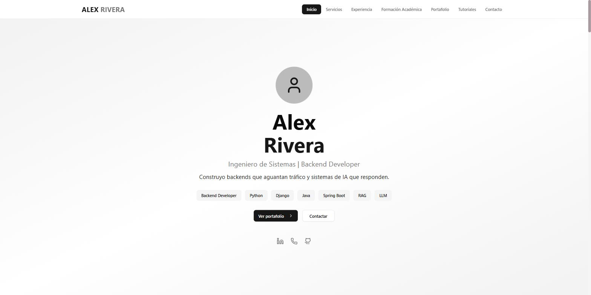
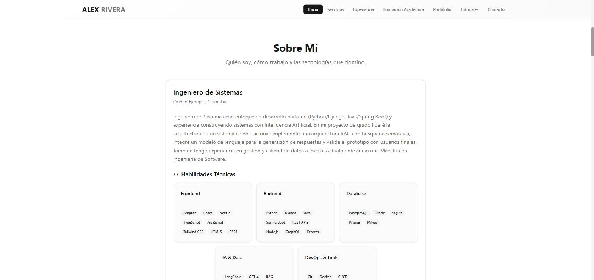
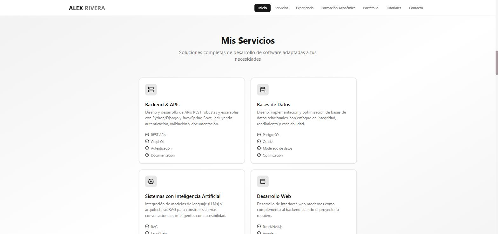
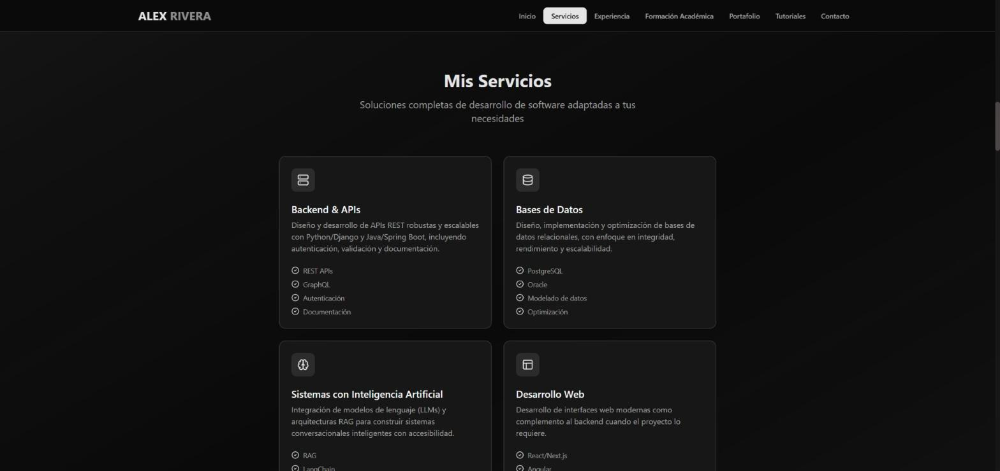
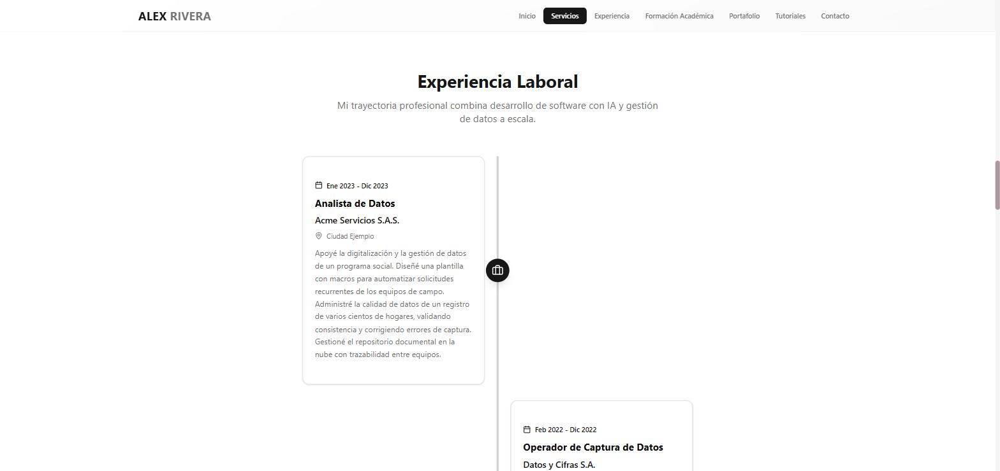
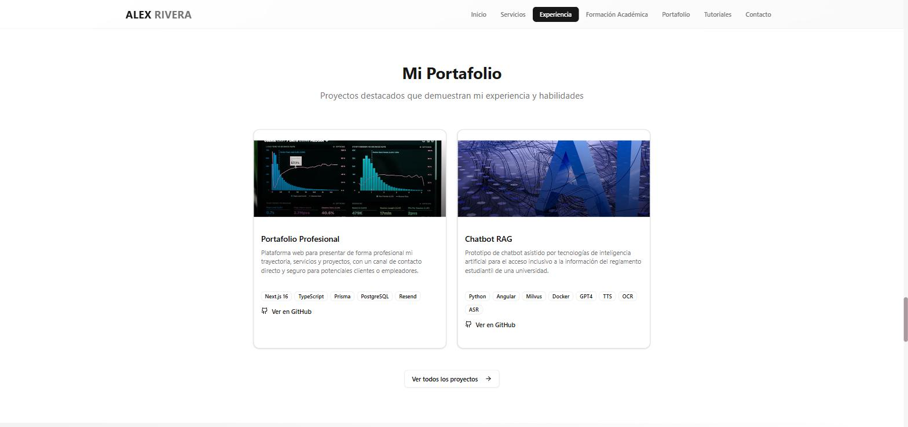
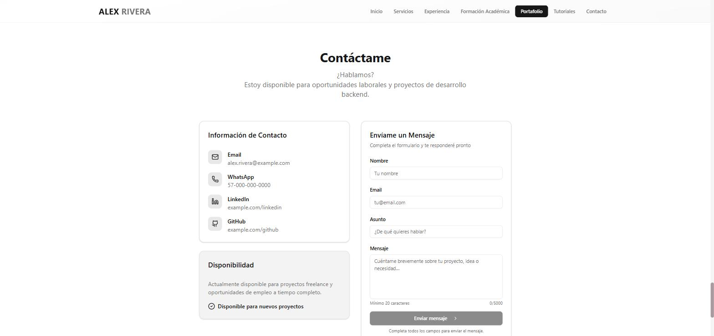
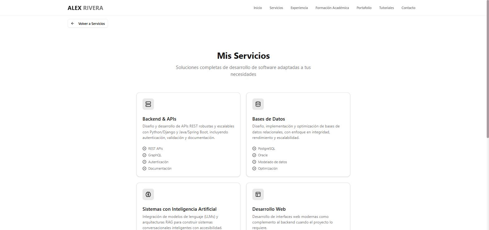

# Portafolio

Portafolio profesional cuyo contenido vive en PostgreSQL y se sirve como HTML estático. Next.js 16 (App Router), React 19, TypeScript, Prisma y Tailwind v4.

[](../../actions/workflows/ci.yml)




<details>
<summary><b>Ver el resto de secciones</b> (7 capturas)</summary>

Todas las capturas salen de los datos de ejemplo que crea `prisma/seed.ts`: la persona, las empresas y los enlaces son ficticios.

**Sobre mí y habilidades**


**Modo claro y modo oscuro** — el tema sigue la preferencia del sistema, sin selector manual.

| Claro | Oscuro |
|---|---|
|  |  |

**Experiencia** — línea de tiempo alterna, ordenada por el campo `order` de cada registro.


**Portafolio**


**Contacto**


**Páginas completas** — cada sección tiene además su propia ruta, con su `<h1>`, su metadata y su URL canónica.


</details>

---

## Qué resuelve

Un portafolio se actualiza a menudo —un proyecto nuevo, un puesto nuevo, otra descripción— y casi siempre eso significa editar JSX y volver a desplegar. Aquí el contenido vive en PostgreSQL y se edita desde Prisma Studio o desde el panel de Supabase: **cambiar el portafolio no requiere tocar el código ni redesplegar**.

La contrapartida habitual de esa decisión es un sitio lento, que pide los datos desde el navegador al abrirse. Aquí no ocurre: las páginas se generan como HTML estático con los datos ya dentro y se regeneran en segundo plano como mucho una vez por hora (ISR). El visitante recibe un documento completo; el navegador no hace ni una consulta.

> Todos los datos de este repositorio —nombre, correo, empresas, formación— son **ficticios**. La identidad de un despliegue real vive en la base de datos y en variables de entorno, nunca en el código. Es una decisión de diseño: el repo es público y el contenido, privado.

## Arquitectura en 60 segundos

```
Supabase (PostgreSQL)
        │
        ▼
src/lib/db.ts          singleton de PrismaClient
        │
        ▼
src/lib/data.ts        8 fetchers envueltos en React cache()
        │               (layout y page piden el perfil sin consultar dos veces)
        ▼
Server Components      src/app/page.tsx y las 5 páginas de sección
        │
        ▼
HTML estático          revalidate = 3600
```

**Frontera cliente/servidor:** 7 de los 50 archivos de `src/` llevan `"use client"`. Todo lo demás se renderiza en el servidor. Los que bajan al navegador son los que necesitan estado o API del DOM: navegación (menú móvil y scroll-spy), formulario de contacto, `SectionLink`, `SafeImage`, el proveedor de tema y el límite de error.

**Tipos:** `src/types/portafolio.ts` deriva de los tipos que genera Prisma, así que el esquema de la base es la única fuente de verdad. Los campos guardados como JSON (`techStack`, `tags`, `features`) se exponen ya parseados.

**Rutas:** 11 estáticas en total; 6 son de contenido con ISR de 1 h (la home y las cinco páginas de sección). El resto son `sitemap.xml`, `robots.txt`, la imagen de Open Graph, el icono y el 404.

## Decisiones y contrapartidas

| Decisión | Por qué | A cambio de |
|---|---|---|
| Server Components + ISR en lugar de fetch en cliente | La home hacía 9 consultas desde el navegador con React Query contra 8 rutas de API. Ahora el HTML llega completo: mejor LCP y SEO | El contenido tarda hasta 1 h en reflejarse, y el build necesita acceso a la base de datos |
| Sin `loading.tsx` | Con ISR, el skeleton dejaba el contenido real en un `<div hidden>` que React 19 revela con `$RC()` al final del documento: las anclas `/#seccion` y la restauración de scroll aterrizaban contra un documento corto | No hay skeleton entre navegaciones |
| Un solo esquema Zod para cliente y servidor | `src/lib/contact-schema.ts` define las reglas una vez; el cliente avisa en vivo y el servidor vuelve a validar antes de enviar. Imposible que se desincronicen | El validador viaja también al navegador |
| Rate limit en memoria, sin Redis | Cero infraestructura para un caso que no la necesita | El límite es por instancia serverless y se pierde en arranques en frío |
| `SectionLink` propio sobre `next/link` | `next/link` hace `preventDefault()` en todo enlace interno y descarta la navegación cuando la URL destino es idéntica a la actual: el enlace a la sección activa quedaba muerto | Un componente cliente más en el nav y el pie |
| Contenido en PostgreSQL, no en MDX ni archivos | Se edita sin desplegar y sin saber Markdown | Hace falta una base de datos para levantarlo, y no hay panel propio: se usa Prisma Studio |

## Detalles que quizá no se ven en las capturas

- **Anclas que aterrizan donde deben.** `scroll-padding-top` compensa el nav fijo y las 8 secciones llevan `tabIndex={-1}`, así que al llegar por `/#servicios` se mueve el scroll **y** el foco: un lector de pantalla anuncia la sección en vez de seguir leyendo desde el principio del documento — `src/components/portafolio/ServicesSection.tsx`.
- **Una sola implementación por sección.** Las cinco páginas completas reutilizan el mismo componente con la prop `isFullPage`, que cambia el encabezado de `h2` a `h1` y oculta el botón «Ver todos» — `src/app/servicios/page.tsx`.
- **Scroll-spy sin listener de scroll.** `IntersectionObserver` con `rootMargin: "-40% 0px -55% 0px"` avisa cuando una sección cruza la franja central; el enlace activo lleva `aria-current="location"` — `src/components/layout/Navigation.tsx`.
- **Anti-spam en tres capas.** Honeypot (`website`), tiempo mínimo de relleno (2,5 s) y límite de 3 envíos cada 5 min. Las dos primeras responden `success` sin enviar nada, para que un bot no aprenda que fue rechazado; el límite se aplica **después** de validar, para que un intento incompleto no consuma cuota — `src/app/actions/send-contact.ts`.
- **Correo que se puede responder.** El `replyTo` lleva el email del visitante, así que contestar desde la bandeja responde al contacto. Plantilla en HTML y texto plano — `src/lib/email.ts`.
- **SEO sin trabajo manual.** `sitemap.xml`, `robots.txt`, canónicas por página e imagen de Open Graph generada en runtime con el nombre y el titular reales — `src/app/opengraph-image.tsx`.
- **Degradación honesta.** Un registro con JSON corrupto se convierte en lista vacía en lugar de tumbar la página; con la base vacía el sitio se renderiza con una identidad de reserva y «Próximamente.» en cada sección — `src/lib/data.ts`, `src/lib/profile-fallback.ts`.
- **Identidad por entorno.** `NEXT_PUBLIC_SITE_NAME`, `NEXT_PUBLIC_SITE_AUTHOR` y `NEXT_PUBLIC_SITE_DESCRIPTION` alimentan títulos, `<meta name="author">` y Open Graph — `src/lib/site.ts`.

## Límites conocidos

Declarados a propósito, no son descuidos pendientes de descubrir:

- **Sin tests automatizados.** La barrera de calidad es lint + typecheck + build en CI.
- **`remotePatterns` acepta cualquier host `https`** (`next.config.ts`). Conviene restringirlo a los hosts reales antes de abrir la escritura de la base a terceros.
- **El rate limit usa `x-forwarded-for`**, que en Vercel llega bien pero es falsificable, y sin proxy que la ponga todos los clientes comparten el mismo cubo.
- **El formulario requiere JavaScript**: la validación en vivo y el control anti-bot se calculan en el cliente.
- **El menú móvil no cierra con Escape** ni al hacer clic fuera; sí al navegar.
- **No hay panel de administración ni autenticación.** El contenido se edita con Prisma Studio o desde Supabase.
- **Idioma y formato fijos a `es-CO`**, sin i18n. Las fechas de experiencia y formación se guardan como texto libre, no como fecha.

## Puesta en marcha

**Requisitos:** [Bun](https://bun.sh) 1.3.14 y una base PostgreSQL propia (Supabase, Neon o local).

```bash
bun install                 # instala y genera el cliente de Prisma
cp .env.example .env        # rellena DATABASE_URL y DIRECT_URL
bun run db:push             # crea las tablas
bun run db:seed             # datos de ejemplo (ver aviso)
bun run dev                 # http://localhost:3000
```

> [!WARNING]
> `db:seed` es destructivo. Borra **todas** las filas de `Skill` y `SkillCategory` y sobrescribe `Profile`, además de eliminar servicios, proyectos y tutoriales con ids antiguos. Ejecútalo solo contra una base de datos vacía o de desarrollo.

Las variables de entorno están documentadas una sola vez, en [`.env.example`](.env.example). Solo `DATABASE_URL` y `DIRECT_URL` son obligatorias; el resto tienen valores por defecto razonables.

## Comandos

| Comando | Qué hace |
|---|---|
| `bun run dev` | Servidor de desarrollo en el puerto 3000 |
| `bun run build` | Build de producción. **Necesita `DATABASE_URL`**: las páginas se generan leyendo la base |
| `bun run lint` | ESLint sobre todo el proyecto |
| `bun run typecheck` | `tsc --noEmit` |
| `bun run db:push` | Sincroniza `schema.prisma` con la base de datos |
| `bun run db:seed` | Puebla con datos de ejemplo (destructivo, ver aviso) |
| `bunx prisma studio` | Interfaz gráfica para editar el contenido |

El modelo de datos completo vive en [`prisma/schema.prisma`](prisma/schema.prisma); no se duplica aquí para que no se desincronice.

Las imágenes son URLs `https` guardadas en la base de datos y las optimiza `next/image`. `SafeImage` (`src/components/ui/safe-image.tsx`) cae a un marcador si una URL falla, así que un enlace roto no deja un hueco en la página.

## Despliegue y CI

Vercel despliega una preview por cada rama y producción desde `main`. El flujo es gitflow: `feature/*` → `develop` → `main`, un PR por cambio.

El workflow de GitHub Actions (`.github/workflows/ci.yml`) ejecuta **lint, typecheck y build** en cada PR hacia `develop` o `main`. El build necesita los secrets `DATABASE_URL` y `DIRECT_URL` porque las páginas se prerenderizan leyendo la base; si faltan, el paso se omite con un aviso en lugar de fallar.

Los pasos detallados —crear el proyecto en Supabase, las dos URLs de conexión y por qué, la configuración de Vercel y el flujo de ramas— están en [DEPLOYMENT.md](DEPLOYMENT.md).

## Licencia

[MIT](LICENSE). Si partes de este repositorio para tu propio portafolio, cambia los datos del seed y las variables de entorno de identidad.
